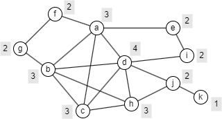
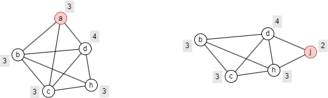

# p-Cohesion

## Overview

The p-Cohesion algorithm computes a per-node cohesion value that measures how well each node is embedded within a densely connected neighborhood. The concept of p-cohesion was first proposed by S. Morris in a contagion model describing interactions within large populations:

- S. Morris, <a target='blank' href="http://snap.stanford.edu/class/cs224w-readings/morris98contagion.pdf">Contagion</a>. The Review of Economic Studies, 67(1), 57–78 (2000)

## Concepts

### p-Cohesion

One natural measure of the **cohesion** of a group is the relative frequency of ties among its members compared to non-members. Let cohesion be a constant `p` ∈ (0,1). A <b>p-Cohesion</b> is a connected subgraph in which every node has, at least, a proportion `p` of its neighbors within the subgraph. In other words, each node has at most, a proportion `(1 − p)` of its neighbors outside the subgraph.

The p-Cohesion model offers two key advantages over other cohesive subgraph models:

- With a high `p` value, p-Cohesion ensures both strong internal cohesiveness and sparse connections to outside nodes.
- It considers the proportion of neighbors within the group rather than a fixed number (such as the `k` value in <a href="/docs/graph-algorithms/k-core">k-Core</a>), making it better suited for graphs with varying node degrees.

The example graph below illustrates this. Suppose `p = 0.6`. A grey label next to each node shows the minimum number of internal neighbors required for the node to remain in a p-Cohesion.

<center></center>

Below are the minimal p-Cohesion subgraphs, in terms of node count, that include node `a` and node `j`, respectively.

<center></center>

### Cohesion Value

This algorithm computes the **cohesion value** of a node, which is the maximum `p` for which the node belongs to a p-cohesive subgraph. A higher cohesion value indicates the node is embedded in a more tightly connected neighborhood.

> Note that p-cohesion is inherently a group property: whether a set of nodes is p-cohesive depends on which nodes form the group together. The per-node cohesion value produced by this algorithm is a useful ranking metric, but does not indicate which specific group the node is cohesive with.

## Considerations

- The algorithm treats all edges as undirected.

## Example Graph

<center></center>

```gql
INSERT (A:default {_id: "A"}), (B:default {_id: "B"}),
       (C:default {_id: "C"}), (D:default {_id: "D"}),
       (E:default {_id: "E"}), (F:default {_id: "F"}),
       (G:default {_id: "G"}), (H:default {_id: "H"}),
       (I:default {_id: "I"}), (J:default {_id: "J"}),
       (K:default {_id: "K"}), (L:default {_id: "L"}),
       (K)-[:default]->(J), (K)-[:default]->(L),
       (J)-[:default]->(L), (L)-[:default]->(C),
       (C)-[:default]->(A), (A)-[:default]->(B),
       (C)-[:default]->(B), (A)-[:default]->(D),
       (B)-[:default]->(G), (B)-[:default]->(D),
       (D)-[:default]->(C), (C)-[:default]->(E),
       (C)-[:default]->(F), (D)-[:default]->(E),
       (E)-[:default]->(F), (D)-[:default]->(F),
       (D)-[:default]->(H), (I)-[:default]->(H),
       (F)-[:default]->(I)
```

## Parameters

| Name | Type | Default | Description |
| -- | -- | -- | -- |
| `p` | `FLOAT` | / | Cohesion threshold (0 < `p` ≤ 1). When set, only nodes with cohesion ≥ `p` are returned. |

## Run Mode

**Returns:**

| Column | Type | Description |
| -- | -- | -- |
| `nodeId` | `STRING` | Node identifier (`_id`) |
| `cohesion` | `FLOAT` | Minimal p-cohesion value for this node |

```gql
CALL algo.pcohesion({
  p: 0.7
}) YIELD nodeId, cohesion
```

## Stream Mode

Returns the same columns as run mode, streamed for memory efficiency.

```gql
CALL algo.pcohesion.stream() YIELD nodeId, cohesion
RETURN nodeId, cohesion
```

## Stats Mode

**Returns:**

| Column | Type | Description |
| -- | -- | -- |
| `nodeCount` | `INT` | Total number of nodes |
| `minCohesion` | `FLOAT` | Minimum cohesion value |
| `maxCohesion` | `FLOAT` | Maximum cohesion value |
| `avgCohesion` | `FLOAT` | Average cohesion value |

```gql
CALL algo.pcohesion.stats() YIELD nodeCount, minCohesion, maxCohesion, avgCohesion
```

## Write Mode

Computes results and writes them back to node properties. The write configuration is passed as a second argument map.

**Write parameters:**

| Name | Type | Description |
| -- | -- | -- |
| `db.property` | `STRING` or `MAP` | Node property to write results to. String: writes the `cohesion` column in results to a property. Map: explicit column-to-property mapping (e.g., `{cohesion: 'p_cohesion'}`). |

**Writable columns:**

| Column | Type | Description |
| -- | -- | -- |
| `cohesion` | `FLOAT` | Minimal p-cohesion value |

**Returns:**

| Column | Type | Description |
| -- | -- | -- |
| `task_id` | `STRING` | Task identifier for tracking via `SHOW TASKS` |
| `nodesWritten` | `INT` | Number of nodes with properties written |
| `computeTimeMs` | `INT` | Time spent computing the algorithm (milliseconds) |
| `writeTimeMs` | `INT` | Time spent writing properties to storage (milliseconds) |

```gql
CALL algo.pcohesion.write({}, {
  db: {
    property: "p_cohesion"
  }
}) YIELD task_id, nodesWritten, computeTimeMs, writeTimeMs
```
