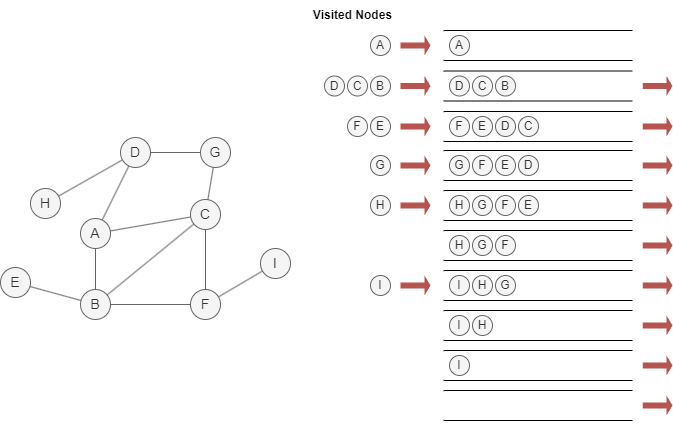
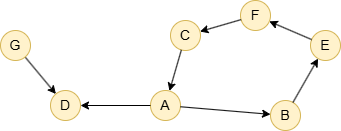

# Breadth-First Search (BFS)

## Overview

Graph traversal is a search technique used to systematically visit and explore all the nodes in a graph. Its primary goal is to reveal and examine the structure and connections of the graph. There are two common strategies for graph traversal: 

- Breadth-First Search (BFS)
- <a target="_blank" href="/docs/graph-algorithms/dfs">Depth-First Search (DFS)</a>

The BFS algorithm explores a graph level by level and proceeds as follows:

1. Create a queue (first in, first out) to keep track of visited nodes.
2. Start from a selected node, enqueue it and mark as visited.
3. Dequeue a node from the front of the queue, enqueue all its unvisited neighbors into the queue and mark them as visited.
4. Repeat step 3 until the queue is empty.

The following example demonstrates BFS traversal starting from node `A`, assuming neighbors are visited in alphabetical order (A–Z):

<center></center>

## Considerations

- Only nodes within the same connected component as the start node will be traversed. Nodes in other connected components are excluded from the traversal results.

## Example Graph

<center></center>

```gql
INSERT (A:default {_id: "A"}), (B:default {_id: "B"}),
       (C:default {_id: "C"}), (D:default {_id: "D"}),
       (E:default {_id: "E"}), (F:default {_id: "F"}),
       (G:default {_id: "G"}),
       (A)-[:default]->(B), (A)-[:default]->(D),
       (B)-[:default]->(E), (C)-[:default]->(A),
       (E)-[:default]->(F), (F)-[:default]->(C),
       (G)-[:default]->(D)
```

## Parameters

| Name | Type | Default | Description |
| -- | -- | -- | -- |
| `startNode` | `STRING` | / | **Required.** Starting node `_id`. |
| `maxDepth` | `INT` | `-1` | Maximum depth to traverse (-1 = unlimited). |
| `direction` | `STRING` | `out` | Edge direction: `in`, `out`, or `both`. |

## Run Mode

**Returns:**

| Column | Type | Description |
| -- | -- | -- |
| `nodeId` | `STRING` | Node identifier (`_id`) |
| `depth` | `INT` | Depth from start node |
| `parent` | `STRING` | Parent node in BFS tree |

```gql
CALL algo.bfs({
  startNode: "A"
}) YIELD nodeId, depth, parent
```

Result:

| nodeId | depth | parent |
| -- | -- | -- |
| A | 0 | |
| D | 1 | A |
| B | 1 | A |
| E | 2 | B |
| F | 3 | E |
| C | 4 | F |

## Stream Mode

Returns the same columns as run mode, streamed for memory efficiency.

```gql
CALL algo.bfs.stream({
  startNode: "A",
  maxDepth: 2
}) YIELD nodeId, depth
RETURN nodeId, depth
```

Result:

| nodeId | depth |
| -- | -- |
| A | 0 |
| D | 1 |
| B | 1 |
| E | 2 |

## Stats Mode

**Returns:**

| Column | Type | Description |
| -- | -- | -- |
| `nodeCount` | `INT` | Total number of nodes visited |
| `maxDepth` | `INT` | Maximum depth reached from start node |

```gql
CALL algo.bfs.stats({
  startNode: "A"
}) YIELD nodeCount, maxDepth
```

Result:

| nodeCount | maxDepth |
| -- | -- |
| 6 | 4 |
