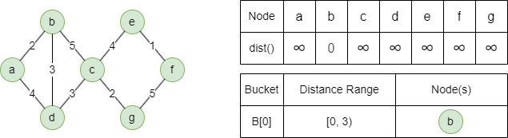
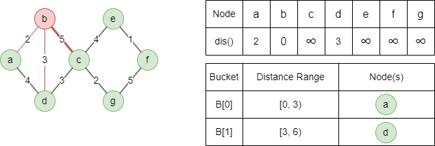
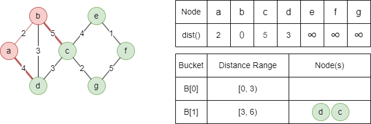
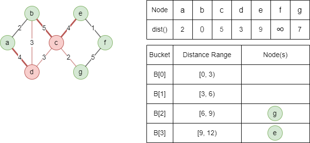
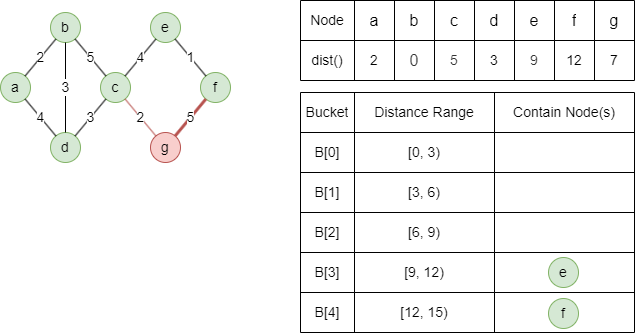
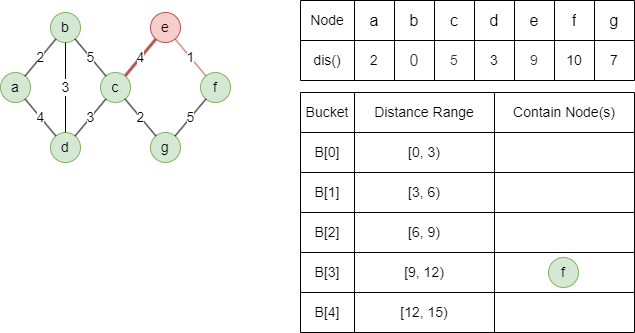
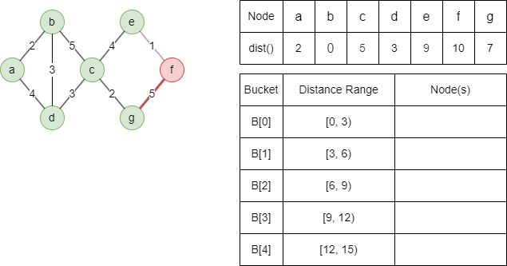

# Delta-Stepping SSSP

## Overview

The <b>single-source shortest path (SSSP)</b> problem involves finding the shortest paths from a given source node to all other reachable nodes in a graph. In weighted graphs, the shortest path minimizes the total edge weights; in unweighted graphs, it minimizes the number of edges (hops). The cost or distance of a path refers to this total weight or count.

The Delta-Stepping algorithm is a parallelizable variant of <a target="_blank" href="/docs/graph-algorithms/dijkstra-shortest-path">Dijkstra's algorithm</a>, designed to improve performance on large graphs by dividing work into manageable steps.

Related material of the algorithm:

- U. Meyer, P. Sanders, <a target="_blank" href="https://www.cs.utexas.edu/~pingali/CS395T/2013fa/papers/delta-stepping.pdf">Δ-Stepping: A Parallel Single Source Shortest Path Algorithm</a> (1998)

## Concepts

### Delta-Stepping Algorithm

The Delta-Stepping SSSP algorithm introduces the concept of **buckets** and performs distance updates in a more coarse-grained manner. The algorithm utilizes a positive real number parameter **delta** (`Δ`) to achieve the following:

- Maintain an array of buckets, such that bucket `B[i]` contains nodes whose distance falls within the range `[iΔ, (i+1)Δ)`. The distance update also includes assigning the node to the corresponding bucket based on its updated distance value.
- Distinguish between **light edges** with `weight ≤ Δ` and **heavy edges** with `weight > Δ`. Light-edge nodes are prioritized during distance updates as they have lower weights and are more likely to yield shorter paths.

Below is an example to compute the weighted shortest paths in an undirected graph from source node `b` with `Δ = 3`:

1\. Initialize the distance of the source node as 0 and the distances of other nodes as infinity. The source node is placed into bucket `B[0]`.

<center></center>

2\. Visit and remove all nodes from the first nonempty bucket `B[i]`:

- Update distances for all light-edge neighbors of the removed nodes, assign the updated nodes to `B[i]` or `B[i+1]`.
- If `B[i]` is refilled, repeat the above until `B[i]` is empty.
- Update distances for all heavy-edge neighbors.

<center></center>

<center>Remove <code>b</code> from <code>B[0]</code>: update light-edge neighbors <code>dist(a) = min(0+2,∞) = 2</code> (assign to <code>B[0]</code>) and <code>dist(d) = min(0+3,∞) = 3</code> (assign to <code>B[1]</code>), defer heavy-edge neighbor <code>c</code></center><br>

<center></center>
  
<center>Remove <code>a</code> from refilled <code>B[0]</code>: no unvisited light-edge neighbors, defer heavy-edge neighbor <code>d</code></center><br>

<center><code>B[0]</code> is empty, update heavy-edge neighbors: <code>dist(c) = min(0+5,∞) = 5</code> (assign to <code>B[1]</code>), <code>dist(d) = min(2+4,3) = 3</code> (no update)</center><br>

3\. Repeat step 2 until all buckets are empty.

<center></center>

<center>Remove <code>d</code> and <code>c</code> from <code>B[1]</code>: update unvisited light-edge neighbors <code>dist(g) = min(5+2,∞) = 7</code> (assign to <code>B[2]</code>), defer heavy-edge neighbor <code>e</code></center><br>

<center><code>B[1]</code> is empty, update heavy-edge neighbors: <code>dist(e) = min(5+4,∞) = 9</code> (assign to <code>B[3]</code>)</center><br>

<center></center>

<center>Remove <code>g</code> from <code>B[2]</code>: no unvisited light-edge neighbors, defer heavy-edge neighbor <code>f</code></center><br>

<center><code>B[2]</code> is empty, update heavy-edge neighbors: <code>dist(f) = min(7+5,∞) = 12</code> (assign to <code>B[4]</code>)</center><br>

<center></center>

<center>Remove <code>e</code> from <code>B[3]</code>: update unvisited light-edge neighbor <code>dist(f) = min(9+1,12) = 10</code> (assign to <code>B[3]</code>), no heavy-edge neighbors</center><br>

<center></center>

<center>Remove <code>f</code> from refilled <code>B[3]</code>: no unvisited light/heavy-edge neighbors</center><br>

The algorithm ends here since all buckets are empty.

By dividing nodes into buckets and processing them in parallel, the Delta-Stepping algorithm efficiently leverages available computational resources, making it well-suited for large-scale graphs and parallel computing environments.

## Considerations

- Delta-Stepping doesn't work with negative weights — it assumes once a node is visited, its distance is final. A negative-weight edge could later provide a shorter path, violating this assumption.
- In disconnected graphs, the algorithm only computes shortest paths to nodes within the same connected component as the source node.

## Example Graph

<center></center>

```gql
INSERT (A:default {_id: "A"}), (B:default {_id: "B"}),
       (C:default {_id: "C"}), (D:default {_id: "D"}),
       (E:default {_id: "E"}), (F:default {_id: "F"}),
       (G:default {_id: "G"}),
       (A)-[:default {value: 2}]->(B), (A)-[:default {value: 4}]->(F),
       (B)-[:default {value: 3}]->(C), (B)-[:default {value: 3}]->(D),
       (B)-[:default {value: 6}]->(F), (D)-[:default {value: 2}]->(E),
       (D)-[:default {value: 2}]->(F), (E)-[:default {value: 3}]->(G),
       (F)-[:default {value: 1}]->(E)
```

## Parameters

| Name | Type | Default | Description |
| -- | -- | -- | -- |
| `startNode` | `STRING` | / | **Required.** Source node `_id`. |
| `delta` | `FLOAT` | `3.0` | Bucket width for relaxation phases. |
| `direction` | `STRING` | `out` | Edge direction: `in`, `out`, or `both`. |

## Run Mode

**Returns:**

| Column | Type | Description |
| -- | -- | -- |
| `nodeId` | `STRING` | Node identifier (`_id`) |
| `distance` | `FLOAT` | Shortest distance from source |

```gql
CALL algo.deltastepping({
  startNode: "A"
}) YIELD nodeId, distance
```

## Stream Mode

Returns the same columns as run mode, streamed for memory efficiency.

```gql
CALL algo.deltastepping.stream({
  startNode: "A"
}) YIELD nodeId, distance
RETURN nodeId, distance
```

## Stats Mode

**Returns:**

| Column | Type | Description |
| -- | -- | -- |
| `nodesReached` | `INT` | Number of nodes reachable from source |
| `maxDistance` | `FLOAT` | Maximum shortest distance from source |

```gql
CALL algo.deltastepping.stats({
  startNode: "A"
}) YIELD nodesReached, maxDistance
```
