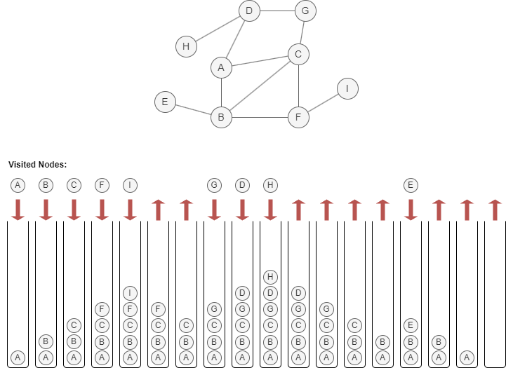

# Depth-First Search (DFS)

## Overview

Graph traversal is a search technique used to systematically visit and explore all the nodes in a graph. Its primary goal is to reveal and examine the structure and connections of the graph. There are two common strategies for graph traversal:

- <a target="_blank" href="/docs/graph-algorithms/bfs">Breadth-First Search (BFS)</a>
- Depth-First Search (DFS)

The DFS algorithm is based on the principle of backtracking and proceeds as follows:

1. Create a stack (last-in, first-out) to keep track of visited nodes.
2. Start from a selected node, push it into the stack, and mark it as visited.
3. Push any unvisited neighbor of the node on the top of the stack into the stack, and mark it as visited. If multiple unvisited neighbors exist, select one arbitrarily or according to a predefined order.
4. Repeat step 3 until there are no more unvisited neighbors to push into the stack. 
5. When there are no new nodes to visit, backtrack to the previous node (the one from which the current node was explored) by popping the top node from the stack.
6. Repeat steps 3, 4 and 5 until the stack is empty.

Below is an example of traversing the graph using the DFS approach, starting from node `A` and assuming to visit neighbors in alphabetical order (A~Z):

<center></center>

## Considerations

- Only nodes within the same connected component as the start node will be traversed. Nodes in other connected components are excluded from the traversal results.

## Example Graph

<center></center>

```gql
INSERT (A:default {_id: "A"}), (B:default {_id: "B"}),
       (C:default {_id: "C"}), (D:default {_id: "D"}),
       (E:default {_id: "E"}), (F:default {_id: "F"}),
       (G:default {_id: "G"}),
       (A)-[:default]->(B), (A)-[:default]->(D),
       (B)-[:default]->(E), (C)-[:default]->(A),
       (E)-[:default]->(F), (F)-[:default]->(C),
       (G)-[:default]->(D)
```

## Parameters

| Name | Type | Default | Description |
| -- | -- | -- | -- |
| `startNode` | `STRING` | / | **Required.** Starting node `_id`. |
| `maxDepth` | `INT` | `-1` | Maximum depth to traverse (-1 = unlimited). |
| `direction` | `STRING` | `out` | Edge direction: `in`, `out`, or `both`. |

## Run Mode

**Returns:**

| Column | Type | Description |
| -- | -- | -- |
| `nodeId` | `STRING` | Node identifier (`_id`) |
| `depth` | `INT` | Depth from start node |
| `parent` | `STRING` | Parent node in DFS tree |
| `discoveryOrder` | `INT` | Order in which the node was first visited |
| `finishOrder` | `INT` | Order in which the node was fully explored |

```gql
CALL algo.dfs({
  startNode: "B",
  direction: "in"
}) YIELD nodeId, depth, parent, discoveryOrder, finishOrder
```

Result:

| nodeId | depth | parent | discoveryOrder | finishOrder |
| -- | -- | -- | -- | -- |
| B | 0 | | 0 | 9 |
| A | 1 | B | 1 | 8 |
| C | 2 | A | 2 | 7 |
| F | 3 | C | 3 | 6 |
| E | 4 | F | 4 | 5 |

## Stream Mode

Returns the same columns as run mode, streamed for memory efficiency.

```gql
CALL algo.dfs.stream({
  startNode: "A",
  maxDepth: 3
}) YIELD nodeId, depth
RETURN nodeId, depth
```

Result:

| nodeId | depth |
| -- | -- |
| A | 0 |
| D | 1 |
| B | 1 |
| E | 2 |
| F | 3 |

## Stats Mode

**Returns:**

| Column | Type | Description |
| -- | -- | -- |
| `nodeCount` | `INT` | Total number of nodes visited |
| `maxDepth` | `INT` | Maximum depth reached from start node |

```gql
CALL algo.dfs.stats({
  startNode: "A"
}) YIELD nodeCount, maxDepth
```

Result:

| nodeCount | maxDepth |
| -- | -- |
| 6 | 4 |
