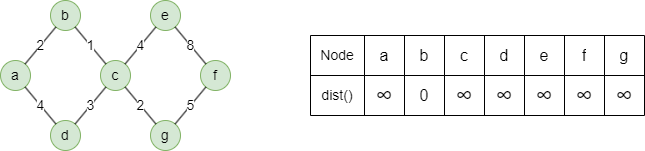
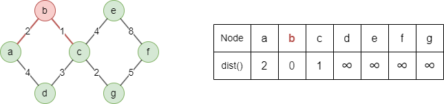
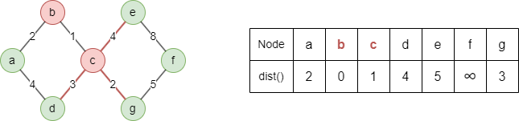
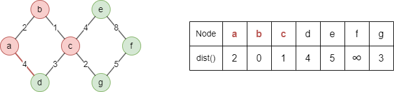
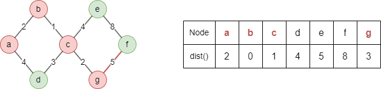

# Dijkstra's Shortest Path

## Overview

This algorithm finds the shortest path between a source node and a target node using Dijkstra's algorithm. In weighted graphs, the shortest path minimizes the total edge weights; in unweighted graphs, it minimizes the number of edges (hops). The cost or distance of a path refers to this total weight or count.

This algorithm was introduced by Dutch computer scientist Edsger W. Dijkstra in 1956.

## Concepts

### Dijkstra's Algorithm

Below is an example of finding the weighted shortest path from source node `b` to target node `g` in an undirected graph:

1\. Create a priority queue to store nodes and their corresponding distances from the source node. Initialize the distance of the source node as 0 and the distances of other nodes as infinity. All nodes are marked as **unvisited**.

<center></center>

2\. Visit node `u` with the minimum distance from the queue, mark it as **visited**, and update the distance of each of its unvisited neighbors `v` as <code>dist(v) = min(dist(u) + w(u,v), dist(v))</code>, where <code>w(u,v)</code> is the weight of edge <code>(u,v)</code>.

<center></center>

<center>Visit <code>b</code>: <code>dist(a) = min(0+2,∞) = 2</code>, <code>dist(c) = min(0+1,∞) = 1</code></center><br>

> Once a node is marked as **visited**, its distance from the source node will no longer change throughout the remainder of the algorithm.

3\. Repeat step 2 until the target node is visited.

<center></center>

<center>Visit <code>c</code>: <code>dist(d) = min(1+3, ∞) = 4</code>, <code>dist(e) = min(1+4, ∞) = 5</code>, <code>dist(g) = min(1+2, ∞) = 3</code></center><br>

<center></center>

<center>Visit <code>a</code>: <code>dist(d) = min(2+4, 4) = 4</code></center><br>

<center></center>

<center>Visit <code>g</code>: <code>dist(f) = min(3+5, ∞) = 8</code></center><br>

The algorithm ends here as the target node `g` is visited. The shortest distance from node `b` to node `g` is 3.

## Considerations

- Dijkstra doesn't work with negative weights — it assumes once a node is visited, its distance is final. A negative-weight edge could later provide a shorter path, violating this assumption.

## Example Graph

<center></center>

```gql
INSERT (A:default {_id: "A"}), (B:default {_id: "B"}),
       (C:default {_id: "C"}), (D:default {_id: "D"}),
       (E:default {_id: "E"}), (F:default {_id: "F"}),
       (G:default {_id: "G"}),
       (A)-[:default {value: 2}]->(B), (A)-[:default {value: 4}]->(F),
       (B)-[:default {value: 3}]->(C), (B)-[:default {value: 3}]->(D),
       (B)-[:default {value: 6}]->(F), (D)-[:default {value: 2}]->(E),
       (D)-[:default {value: 2}]->(F), (E)-[:default {value: 3}]->(G),
       (F)-[:default {value: 1}]->(E)
```

## Parameters

| Name | Type | Default | Description |
| -- | -- | -- | -- |
| `source` | `STRING` | / | **Required.** Source node `_id`. |
| `target` | `STRING` | / | **Required.** Target node `_id`. |
| `weight` | `STRING` | / | Numeric edge property to use as weight. If unset, all edges have unit weight. |
| `direction` | `STRING` | `out` | Edge direction: `in`, `out`, or `both`. |

## Run Mode

**Returns:**

| Column | Type | Description |
| -- | -- | -- |
| `nodeId` | `STRING` | Node identifier (`_id`) in the path |
| `cost` | `FLOAT` | Total cost to reach this node from source |
| `index` | `INT` | Position in the path (0 = source) |
| `path` | `STRING` | Full path as string |

```gql
CALL algo.shortestpath({
  source: "A",
  target: "G",
  weight: "value"
}) YIELD nodeId, cost, index, path
```

Result:

| nodeId | cost | index | path |
| -- | -- | -- | -- |
| A | 0 | 0 | A -> F -> E -> G |
| F | 4 | 1 | A -> F -> E -> G |
| E | 5 | 2 | A -> F -> E -> G |
| G | 8 | 3 | A -> F -> E -> G |

## Stream Mode

Returns the same columns as run mode, streamed for memory efficiency.

```gql
CALL algo.shortestpath.stream({
  source: "A",
  target: "G",
  weight: "value"
}) YIELD nodeId, cost
RETURN nodeId, cost
```

Result:

| nodeId | cost |
| -- | -- |
| A | 0 |
| F | 4 |
| E | 5 |
| G | 8 |

## Stats Mode

**Returns:**

| Column | Type | Description |
| -- | -- | -- |
| `nodeCount` | `INT` | Number of nodes in the shortest path |
| `totalCost` | `FLOAT` | Total cost of the shortest path |

```gql
CALL algo.shortestpath.stats({
  source: "A",
  target: "G"
}) YIELD nodeCount, totalCost
```

Result:

| nodeCount | totalCost |
| -- | -- |
| 4 | 3 |
