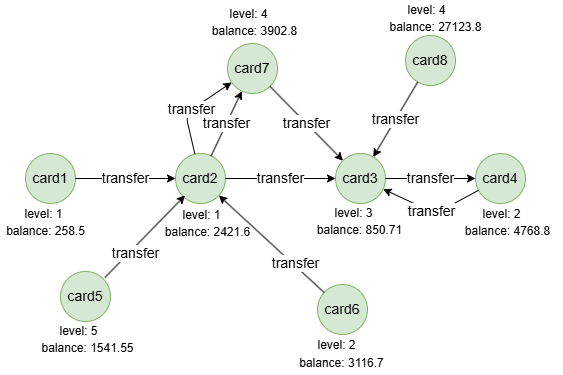

# K-Hop Fast

## Overview

The K-Hop Fast algorithm counts the number of nodes reachable within a specified hop range from a given start node. It uses a bitmap-based BFS with direction-optimized traversal, designed for high performance on large graphs.

## Concepts

### K-Hop Neighbors

The **K-hop neighbors** of a node are the nodes located at a shortest distance of `K` from that node. The shortest distance is the number of edges in the shortest path. In graph theory, a hop is when a node travels to another node via an edge.

<center></center>

In this graph, nodes `{B, C, D}` are the 1-hop neighbors of node `A`, `{E, F, G}` are the 2-hop neighbors, and `{H}` is the 3-hop neighbor.

Key properties of K-hop neighbors:

- `K` is determined solely by the shortest distance and is **unique**. For example, there may be many paths between two nodes, but `K` is always the shortest. A node will only appear at one hop level.
- K-hop results are **deduplicated**. Even if multiple shortest paths exist to the same node, it appears only once.

## Considerations

- This algorithm requires the compute engine topology. Run `ALTER GRAPH <graphName> SET COMPUTE ENABLED` before using it.

## Example Graph

<center></center>

```gql
INSERT (card1:card {_id: "card1"}), (card2:card {_id: "card2"}),
       (card3:card {_id: "card3"}), (card4:card {_id: "card4"}),
       (card5:card {_id: "card5"}), (card6:card {_id: "card6"}),
       (card7:card {_id: "card7"}), (card8:card {_id: "card8"}),
       (card1)-[:transfer]->(card2), (card2)-[:transfer]->(card3),
       (card2)-[:transfer]->(card7), (card2)-[:transfer]->(card7),
       (card3)-[:transfer]->(card4), (card4)-[:transfer]->(card3),
       (card5)-[:transfer]->(card2), (card6)-[:transfer]->(card2),
       (card7)-[:transfer]->(card3), (card8)-[:transfer]->(card3)
```

## Parameters

| Name | Type | Default | Description |
| -- | -- | -- | -- |
| `startNode` | `STRING` | / | **Required.** Starting node `_id`. |
| `maxHops` | `INT` | `3` | Maximum number of hops. |
| `minHops` | `INT` | `1` | Minimum number of hops to start counting. |
| `direction` | `STRING` | `out` | Edge direction: `in`, `out`, or `both`. |

## Run Mode

**Returns:**

| Column | Type | Description |
| -- | -- | -- |
| `count` | `INT` | Total number of K-hop neighbors in the hop range |
| `hops` | `LIST` | Per-hop counts as a list of integers |

```gql
CALL algo.khop_fast({
  startNode: "card1",
  maxHops: 3,
  direction: "out"
}) YIELD count, hops
```

Result:

| count	| hops |
| -- | -- |
| 1 |	4	|

## Stats Mode

**Returns:**

| Column | Type | Description |
| -- | -- | -- |
| `count` | `INT` | Total number of K-hop neighbors |
| `nodeCount` | `INT` | Total nodes in graph |

```gql
CALL algo.khop_fast.stats({
  startNode: "card1",
  maxHops: 3,
  direction: "out"
}) YIELD count, nodeCount
```

Result:

| count	| nodeCount |
| -- | -- |
| 3 |	8	|