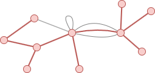

# Minimum Spanning Tree (MST)

## Overview

The Minimum Spanning Tree (MST) algorithm computes a spanning tree with the minimum total edge weight for each connected component in a graph.

The MST has a wide range of applications, including network design, clustering, and other optimization problems where minimizing overall cost or weight is essential.

## Concepts

### Spanning Tree

A spanning tree is a connected subgraph that includes all the nodes of a connected graph `G = (V, E)` (or of a connected component) and forms a tree (i.e., a graph with no circles). A graph may have multiple spanning trees, but each spanning tree must contain (|V| - 1) edges.

In the example below, the 11 nodes of the graph and the 10 edges highlighted in red form a spanning tree:

<center></center>

### Minimum Spanning Tree

An MST is a spanning tree with the minimum total sum of edge weights. A graph may have multiple valid MSTs if some edges share the same weight.

This implementation constructs the MST by:

1. Start with each node as its own isolated group.
2. Sort all edges by weight from lightest to heaviest.
3. Go through edges one by one. If an edge connects two nodes in **different** groups, add it to the MST and merge the two groups into one. If both nodes are already in the **same** group, skip it — adding it would form a cycle.
4. Stop when all nodes belong to one group.

## Considerations

- The MST algorithm treats all edges as undirected.

## Example Graph

<center></center>

```gql
INSERT (A:default {_id: "A"}), (B:default {_id: "B"}),
       (C:default {_id: "C"}), (D:default {_id: "D"}),
       (E:default {_id: "E"}), (F:default {_id: "F"}),
       (G:default {_id: "G"}), (H:default {_id: "H"}),
       (A)-[:default {distance: 1}]->(B), (A)-[:default {distance: 2.4}]->(C),
       (A)-[:default {distance: 1.2}]->(D), (A)-[:default {distance: 0.7}]->(E),
       (A)-[:default {distance: 2.2}]->(F), (A)-[:default {distance: 1.6}]->(G),
       (A)-[:default {distance: 0.4}]->(H), (B)-[:default {distance: 1.3}]->(C),
       (C)-[:default {distance: 1}]->(D), (D)-[:default {distance: 1.65}]->(H),
       (E)-[:default {distance: 1.27}]->(F), (E)-[:default {distance: 0.9}]->(G),
       (F)-[:default {distance: 0.45}]->(G)
```

## Parameters

This algorithm accepts no parameters.

## Run Mode

**Returns:**

| Column | Type | Description |
| -- | -- | -- |
| `sourceId` | `STRING` | Source node identifier (`_id`) of MST edge |
| `targetId` | `STRING` | Target node identifier (`_id`) of MST edge |
| `weight` | `FLOAT` | Weight of MST edge |
| `totalWeight` | `FLOAT` | Total weight of the MST |

```gql
CALL algo.mst() YIELD sourceId, targetId, weight, totalWeight
```

## Stream Mode

Returns the same columns as run mode, streamed for memory efficiency.

```gql
CALL algo.mst.stream() YIELD sourceId, targetId, weight
RETURN sourceId, targetId, weight
```

## Stats Mode

**Returns:**

| Column | Type | Description |
| -- | -- | -- |
| `edgeCount` | `INT` | Number of edges in the MST |
| `totalWeight` | `FLOAT` | Total weight of the MST |

```gql
CALL algo.mst.stats() YIELD edgeCount, totalWeight
```
