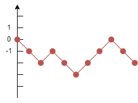
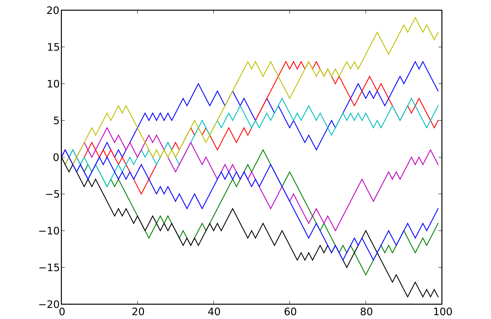
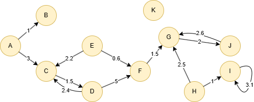

# Random Walk

## Overview

A random walk begins at a specific node in a graph and moves by randomly selecting one of its neighboring nodes at each step. This process is often repeated for a set number of steps. Introduced by British mathematician and biostatistician Karl Pearson in 1905, the concept has since become a cornerstone in studying a wide range of systems, both inside and beyond graph theory.

- K. Pearson, <a target="_blank" href="https://www.nature.com/articles/072294b0/">The Problem of the Random Walk</a> (1905)

## Concepts

### Random Walk

A random walk is a mathematical model employed to simulate a sequence of steps taken in a stochastic or unpredictable manner—much like the erratic path of a drunken person. 

The simplest form of a random walk occurs in one-dimensional space: a node starts at the origin of a number line and moves either one unit up or down at each step, with equal probability. An example of a 10-step random walk is shown below:

<center></center>

Here is an example of performing multiple random walks, each consisting of 100 steps:

<center></center>

### Random Walk in Graph

In a graph, a random walk is a process that forms a path by starting at a node and sequentially moving to neighboring nodes. This process is controlled by the walk depth, which determines how many nodes will be visited.

Ultipa's Random Walk algorithm implements the classical version of random walk. By default, all edges are assigned equal weights (set to 1), resulting in equal traversal probabilities. When edge weights are specified, the likelihood of traversing an edge becomes proportional to its weight.

## Considerations

- Self-loops can also be traversed during a random walk.
- A random walk cannot start from an isolated node, as there are no adjacent edges to follow. 
- The Random Walk algorithm treats all edges as undirected, ignoring their original direction.

## Example Graph

<center></center>

```gql
INSERT (A:default {_id: "A"}), (B:default {_id: "B"}),
       (C:default {_id: "C"}), (D:default {_id: "D"}),
       (E:default {_id: "E"}), (F:default {_id: "F"}),
       (G:default {_id: "G"}), (H:default {_id: "H"}),
       (I:default {_id: "I"}), (J:default {_id: "J"}),
       (K:default {_id: "K"}),
       (A)-[:default]->(B), (A)-[:default]->(C),
       (C)-[:default]->(D), (D)-[:default]->(C),
       (D)-[:default]->(F), (E)-[:default]->(C),
       (E)-[:default]->(F), (F)-[:default]->(G),
       (G)-[:default]->(J), (H)-[:default]->(G),
       (H)-[:default]->(I), (I)-[:default]->(I),
       (J)-[:default]->(G)
```

## Parameters

| Name | Type | Default | Description |
| -- | -- | -- | -- |
| `startNode` | `STRING` | / | **Required.** Starting node `_id`. |
| `walkLength` | `INT` | `80` | Number of steps per walk. |
| `walksPerNode` | `INT` | `10` | Number of walks to generate. |
| `returnFactor` | `FLOAT` | `1.0` | Return parameter `p`. Lower values increase the likelihood of backtracking to the previous node. |
| `inOutFactor` | `FLOAT` | `1.0` | In-out parameter `q`. Lower values favor DFS-like exploration; higher values favor BFS-like exploration. |

## Run Mode

**Returns:**

| Column | Type | Description |
| -- | -- | -- |
| `walkId` | `INT` | Walk sequence number |
| `nodeSequence` | `LIST` | Ordered list of node `_id`s visited |

```gql
CALL algo.randomwalk({
  startNode: "A",
  walkLength: 6,
  walksPerNode: 2
}) YIELD walkId, nodeSequence
```

## Stream Mode

Returns the same columns as run mode, streamed for memory efficiency.

```gql
CALL algo.randomwalk.stream({
  startNode: "A",
  walkLength: 6,
  walksPerNode: 2
}) YIELD walkId, nodeSequence
RETURN walkId, nodeSequence
```

## Stats Mode

**Returns:**

| Column | Type | Description |
| -- | -- | -- |
| `walkCount` | `INT` | Total number of walks generated |
| `avgWalkLength` | `FLOAT` | Average walk length across all walks |

```gql
CALL algo.randomwalk.stats({
  startNode: "A",
  walkLength: 6,
  walksPerNode: 2
}) YIELD walkCount, avgWalkLength
```
