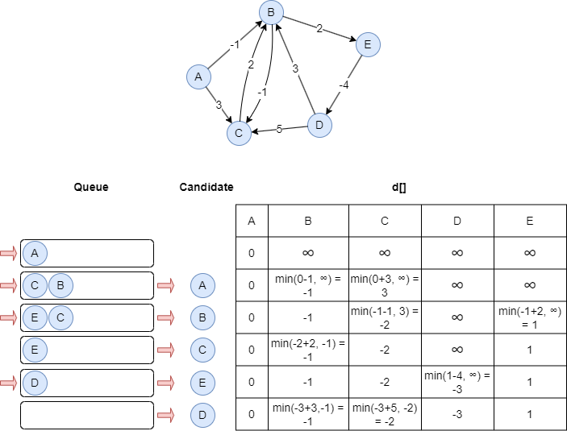

# Shortest Path Faster Algorithm (SPFA)

## Overview

The Shortest Path Faster Algorithm (SPFA) is an improvement of the Bellman–Ford algorithm which computes the shortest paths from a source node to all other reachable nodes (i.e., single-source shortest paths) in a graph. It is especially well-suited for graphs with negative-weight edges.

The algorithm was first published by E.F. Moore in 1959, but it was later rediscovered and popularized under the name "Shortest Path Faster Algorithm (SPFA)" by FanDing Duan in 1994. 

- F. Duan, <a target="_blank" href="https://xueshu.baidu.com/usercenter/paper/show?paperid=39798c8bf2d1b5236cdaae3152d490ed&site=xueshu_se">关于最短路径的SPFA快速算法 [About the SPFA algorithm]</a> (1994)

## Concepts

### SPFA Algorithm

Given a graph `G = (V, E)` and a source node `s ∈ V`, array `d[]` is used to store the distances of the shortest paths from `s` to all nodes. Initialize all elements in `d[]` to infinity, except for `d[s] = 0`.

The basic idea of SPFA is the same as the <a target="_blank" href="https://en.wikipedia.org/wiki/Bellman%E2%80%93Ford_algorithm">Bellman–Ford algorithm</a> in that each node is used as a candidate to update distance for its adjacent nodes. However, SPFA improves efficiency by avoiding unnecessary iterations over all nodes. Instead, it maintains a first-in, first-out queue `Q` to store candidate nodes, and a node is added to the queue only when it has been updated.

During each iteration, SPFA dequeues a node `u` from `Q` as a candidate. For each edge `(u,v)` in the graph, if node `v` can be updated, the following steps are performed:

- Update node `v`: `d[v] = min(d[u] + w(u,v), d[v])`.
- Push node `v` into `Q` if it is not in `Q`.

This process repeats until no more nodes can be relaxed.

The steps below illustrate how to compute the SPFA with source node `A` and find the weighted shortest paths in the outgoing direction:

<center></center>

## Considerations

- SPFA can handle graphs with negative edge weights, provided the source node cannot reach a **negative cycle** (a cycle where the sum of edge weights is negative). If a negative cycle is reachable, the algorithm detects it and reports it via the `hasNegativeCycle` flag in stats mode.
- In disconnected graphs, the algorithm only computes shortest paths to nodes within the same connected component as the source node.

## Example Graph

<center></center>

```gql
INSERT (A:default {_id: "A"}), (B:default {_id: "B"}),
       (C:default {_id: "C"}), (D:default {_id: "D"}),
       (E:default {_id: "E"}), (F:default {_id: "F"}),
       (G:default {_id: "G"}),
       (A)-[:default {value: 2}]->(B), (A)-[:default {value: 4}]->(F),
       (B)-[:default {value: 3}]->(C), (B)-[:default {value: 3}]->(D),
       (B)-[:default {value: 6}]->(F), (D)-[:default {value: 2}]->(E),
       (D)-[:default {value: 2}]->(F), (E)-[:default {value: 3}]->(G),
       (F)-[:default {value: 1}]->(E)
```

## Parameters

| Name | Type | Default | Description |
| -- | -- | -- | -- |
| `sourceNode` | `STRING` | / | **Required.** Source node `_id`. |
| `direction` | `STRING` | `out` | Edge direction: `in`, `out`, or `both`. |

## Run Mode

**Returns:**

| Column | Type | Description |
| -- | -- | -- |
| `nodeId` | `STRING` | Node identifier (`_id`) |
| `distance` | `INT` | Shortest distance from source |
| `predecessor` | `STRING` | Predecessor node in the shortest path tree |

```gql
CALL algo.spfa({
  sourceNode: "A"
}) YIELD nodeId, distance, predecessor
```

## Stream Mode

Returns the same columns as run mode, streamed for memory efficiency.

```gql
CALL algo.spfa.stream({
  sourceNode: "A"
}) YIELD nodeId, distance
RETURN nodeId, distance
```

## Stats Mode

**Returns:**

| Column | Type | Description |
| -- | -- | -- |
| `nodeCount` | `INT` | Number of reachable nodes |
| `maxDistance` | `INT` | Maximum shortest distance from source |
| `hasNegativeCycle` | `INT` | 1 if a negative cycle is detected, 0 otherwise |

```gql
CALL algo.spfa.stats({
  sourceNode: "A"
}) YIELD nodeCount, maxDistance, hasNegativeCycle
```
