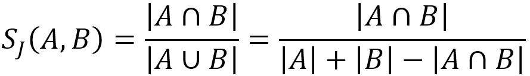
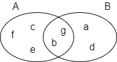
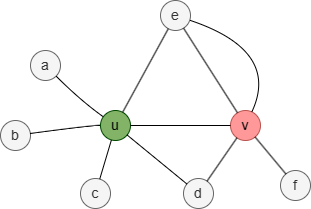
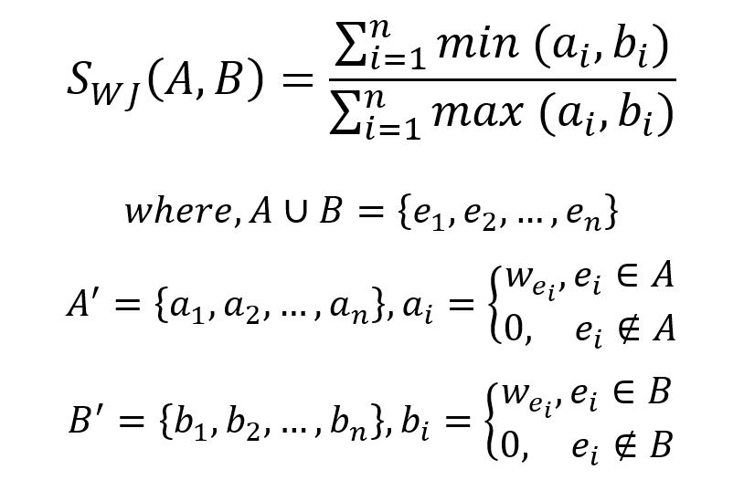
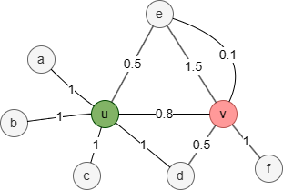
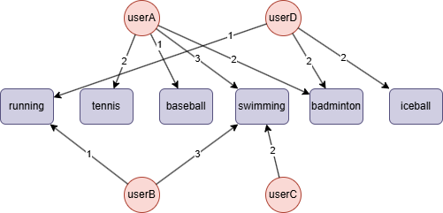

# Jaccard Similarity

## Overview

Jaccard similarity, or Jaccard index, was proposed by Paul Jaccard in 1901. It’s a metric of similarity for two sets of data. In the graph, collecting the neighbors of a node into a set, two nodes are considered similar if their neighborhood sets are similar.

Jaccard similarity ranges from 0 to 1, where 1 indicates that two sets are identical, and 0 indicates that they share no common elements.

## Concepts

### Jaccard Similarity

Given two sets `A` and `B`, the Jaccard similarity between them is computed as:

<center></center>

In the following example, set `A = {b,c,e,f,g}`, set `B = {a,d,b,g}`, their intersection `A⋂B = {b,g}`, their union `A⋃B = {a,b,c,d,e,f,g}`, hence the Jaccard similarity between `A` and `B` is `2 / 7 = 0.285714`.

<center></center>

When applying Jaccard Similarity to compare two nodes in a graph, we use the 1-hop neighborhood set to represent each target node. The 1-hop neighborhood set:

- contains no repeated nodes;
- excludes the two target nodes.

<center></center>

In this graph, the 1-hop neighborhood set of nodes `u` and `v` is:

- N<sub>u</sub> = {a,b,c,d,e}
- N<sub>v</sub> = {d,e,f}

Therefore, the Jaccard similarity between nodes `u` and `v` is `2 / 6 = 0.333333`.

### Weighted Jaccard Similarity

The Weighted Jaccard Similarity is an extension of the classic Jaccard Similarity that takes into account the weights associated with elements in the sets being compared.

The formula for Weighted Jaccard Similarity is given by:

<center></center>

<center></center>

In this weighted graph, the union of the 1-hop neighborhood sets N<sub>u</sub> and N<sub>v</sub> is {a,b,c,d,e,f}. For each element in the union set, assign a value equal to the sum of the edge weights between the target node and the corresponding node; assign 0 if no edge exists between them:

| | a | b | c | d | e | f |
| -- | -- | -- | -- | -- | -- | -- |
| N'<sub>u</sub> | 1 | 1 | 1 | 1 | 0.5 | 0 |
| N'<sub>v</sub> | 0 | 0 | 0 | 0.5 | 1.5 + 0.1 =1.6 | 1 |

Therefore, the Weighted Jaccard Similarity between nodes *u* and *v* is `(0+0+0+0.5+0.5+0) / (1+1+1+1+1.6+1) = 0.151515`.

> Please ensure that the sum of the edge weights between the target node and the neighboring node is greater than or equal to 0.

## Considerations

- The algorithm treats all edges as undirected.
- Self-loops are ignored when computing neighborhoods.

## Example Graph

<center></center>

```gql
INSERT (userA:user {_id: "userA"}), (userB:user {_id: "userB"}),
       (userC:user {_id: "userC"}), (userD:user {_id: "userD"}),
       (running:sport {_id: "running"}), (tennis:sport {_id: "tennis"}),
       (baseball:sport {_id: "baseball"}), (swimming:sport {_id: "swimming"}),
       (badminton:sport {_id: "badminton"}), (iceball:sport {_id: "iceball"}),
       (userA)-[:likes {weight: 2}]->(tennis),
       (userA)-[:likes {weight: 1}]->(baseball),
       (userA)-[:likes {weight: 3}]->(swimming),
       (userA)-[:likes {weight: 2}]->(badminton),
       (userB)-[:likes {weight: 1}]->(running),
       (userB)-[:likes {weight: 3}]->(swimming),
       (userC)-[:likes {weight: 2}]->(swimming),
       (userD)-[:likes {weight: 1}]->(running),
       (userD)-[:likes {weight: 2}]->(badminton),
       (userD)-[:likes {weight: 2}]->(iceball)
```

## Parameters

| Name | Type | Default | Description |
| -- | -- | -- | -- |
| `type` | `STRING` | `jaccard` | Type of similarity to compute: `jaccard`. |
| `ids` | `LIST` | / | First group of node `_id`s. If empty, all nodes are used. |
| `ids2` | `LIST` | / | Second group of node `_id`s for pairing mode. If empty, selection mode is used. |
| `weight` | `LIST` | / | Numeric edge properties used as weights for weighted Jaccard. |
| `degreeCutoff` | `INT` | `0` | Minimum degree to include a node (0 = no cutoff). |
| `order` | `STRING` | / | Sorts results by `similarity`: `asc` or `desc`. |
| `limit` | `INT` | `-1` | Maximum total results returned (-1 = all). |
| `top_limit` | `INT` | `-1` | Maximum results per source node in selection mode (-1 = all). |

Supports three computation modes:

- **All-pairs**: When both `ids` and `ids2` are empty, computes similarity between all node pairs in the graph.
- **Pairing**: When both `ids` and `ids2` are specified, computes similarity between each node in `ids` and each node in `ids2`.
- **Selection**: When only `ids` is specified (no `ids2`), computes similarity between each node in `ids` and all other nodes. Use `top_limit` to limit results per source node.

## Run Mode

**Returns:**

| Column | Type | Description |
| -- | -- | -- |
| `node1` | `STRING` | First node identifier (`_id`) |
| `node2` | `STRING` | Second node identifier (`_id`) |
| `similarity` | `FLOAT` | Computed similarity score |

Jaccard similarity in pairing mode:

```gql
CALL algo.similarity({
  type: "jaccard",
  ids: ["userC"],
  ids2: ["userA", "userB", "userD"]
}) YIELD node1, node2, similarity
```

Result:

| node1 | node2 | similarity |
| -- | -- | -- |
| userC | userA | 0.25 |
| userC | userB | 0.5 |
| userC | userD | 0 |

Jaccard similarity in selection mode:

```gql
CALL algo.similarity({
  type: "jaccard",
  ids: ["userA"],
  weight: ["weight"],
  top_limit: 2
}) YIELD node1, node2, similarity
RETURN node1, node2, similarity
```

Result:

| node1 | node2 | similarity |
| -- | -- | -- |
| userA | userB | 0.3333333333333333 |
| userA | userC | 0.25 |

## Stream Mode

Returns the same columns as run mode, streamed for memory efficiency.

```gql
CALL algo.similarity.stream({
  type: "jaccard",
  degreeCutoff: 3
}) YIELD node1, node2, similarity
RETURN node1, node2, similarity
```

Result:

| node1 | node2 | similarity |
| -- | -- | -- |
| swimming | userA | 0 |
| swimming | userD | 0 |
| userA | swimming | 0 |
| userA | userD | 0.16666666666666666 |
| userD | swimming | 0 |
| userD | userA | 0.16666666666666666 |

## Stats Mode

**Returns:**

| Column | Type | Description |
| -- | -- | -- |
| `pairCount` | `INT` | Number of node pairs computed |
| `minSimilarity` | `FLOAT` | Minimum similarity score |
| `maxSimilarity` | `FLOAT` | Maximum similarity score |
| `avgSimilarity` | `FLOAT` | Average similarity score |

```gql
CALL algo.similarity.stats({
  type: "jaccard"
}) YIELD pairCount, minSimilarity, maxSimilarity, avgSimilarity
```

Result:

| pairCount | minSimilarity | maxSimilarity | avgSimilarity |
| -- | -- | -- | -- |
| 90 | 0 | 1 | 0.1303703703703704 |

## Write Mode

Computes results and writes them back to node properties. The write configuration is passed as a second argument map.

**Write parameters:**

| Name | Type | Description |
| -- | -- | -- |
| `db.property` | `STRING` or `MAP` | Node property to write results to. String: writes the `similarity` column in results to a property. Map: explicit column-to-property mapping (e.g., `{similarity: 'sim_score'}`). |

**Writable columns:**

| Column | Type | Description |
| -- | -- | -- |
| `similarity` | `FLOAT` | Computed similarity score |

**Returns:**

| Column | Type | Description |
| -- | -- | -- |
| `task_id` | `STRING` | Task identifier for tracking via `SHOW TASKS` |
| `nodesWritten` | `INT` | Number of nodes with properties written |
| `computeTimeMs` | `INT` | Time spent computing the algorithm (milliseconds) |
| `writeTimeMs` | `INT` | Time spent writing properties to storage (milliseconds) |

```gql
CALL algo.similarity.write({type: "jaccard", ids: ["userA", "userB"]}, {
  db: {
    property: "sim_score"
  }
}) YIELD task_id, nodesWritten, computeTimeMs, writeTimeMs
```
