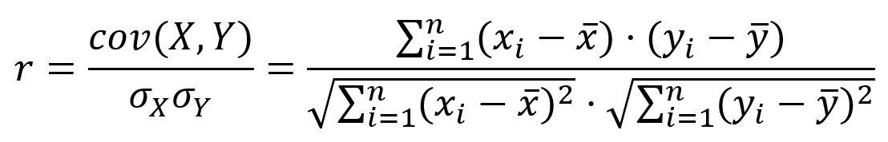
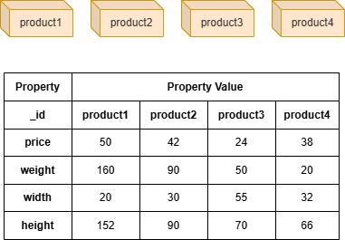

# Pearson Correlation Coefficient

## Overview

The Pearson correlation coefficient is the most common way of measuring the strength and direction of the linear relationship between two quantitative variables. In the graph, nodes are quantified by `N` numeric properties (features) of them.

For two variables <code>X = (x<sub>1</sub>, x<sub>2</sub>, ..., x<sub>n</sub>)</code> and <code>Y = (y<sub>1</sub>, y<sub>2</sub>, ..., y<sub>n</sub>)</code> , Pearson correlation coefficient (`r`) is defined as the ratio of the covariance of them to the product of their standard deviations:

<center></center>

The Pearson correlation coefficient ranges from -1 to 1:

| <div table-width="23">Pearson correlation coefficient</div> | <div table-width="20">Correlation type</div> | Interpretation |
| -- | -- | -- |
| 0 < `r` ≤ 1 | Positive correlation | As one variable becomes larger, the other variable becomes larger |
| `r` = 0 | No linear correlation | (May exist some other types of correlation) |
| -1 ≤ `r` < 0 | Negative correlation | As one variable becomes larger, the other variable becomes smaller |

## Considerations

- Theoretically, the calculation of Pearson correlation coefficient between two nodes is independent of their connectivity.

## Example Graph

<center></center>

```gql
INSERT (:product {_id:"product1", price:50, weight:160, width:20, height:152}),
       (:product {_id:"product2", price:42, weight:90, width:30, height:90}),
       (:product {_id:"product3", price:24, weight:50, width:55, height:70}),
       (:product {_id:"product4", price:38, weight:20, width:32, height:66})
```

## Parameters

| Name | Type | Default | Description |
| -- | -- | -- | -- |
| `type` | `STRING` | `jaccard` | Type of similarity to compute: `pearson`. |
| `ids` | `LIST` | / | First group of node `_id`s. If empty, all nodes are used. |
| `ids2` | `LIST` | / | Second group of node `_id`s for pairing mode. If empty, selection mode is used. |
| `node_property` | `LIST` | / | **Required.** Numeric node properties to form a vector for each node. |
| `degreeCutoff` | `INT` | `0` | Minimum degree to include a node (0 = no cutoff). |
| `order` | `STRING` | / | Sorts results by `similarity`: `asc` or `desc`. |
| `limit` | `INT` | `-1` | Maximum total results returned (-1 = all). |
| `top_limit` | `INT` | `-1` | Maximum results per source node in selection mode (-1 = all). |

Supports three computation modes:

- **All-pairs**: When both `ids` and `ids2` are empty, computes similarity between all node pairs in the graph.
- **Pairing**: When both `ids` and `ids2` are specified, computes similarity between each node in `ids` and each node in `ids2`.
- **Selection**: When only `ids` is specified (no `ids2`), computes similarity between each node in `ids` and all other nodes. Use `top_limit` to limit results per source node.

## Run Mode

```gql
CALL algo.similarity({
  type: "pearson",
  ids: ["product1", "product2"],
  ids2: ["product2", "product3", "product4"],
  node_property: ["price", "weight", "width", "height"],
  order: "desc"
}) YIELD node1, node2, similarity
```

Result:

| node1 | node2 | similarity |
| -- | -- | -- |
| product1 | product2 | 0.9987851216012547 |
| product2 | product3 | 0.5078377565989604 |
| product1 | product3 | 0.4743838031328631 |
| product2 | product4 | 0.25357307126950623 |
| product1 | product4 | 0.21049415016958328 |

## Stream Mode

```gql
CALL algo.similarity.stream({
  type: "pearson",
  ids: ["product1", "product3"],
  node_property: ["price", "weight", "width", "height"],
  top_limit: 1,
  order: "desc"
}) YIELD node1, node2, similarity
RETURN node1, node2, similarity
```

| node1 | node2 | similarity |
| -- | -- | -- |
| product1 | product2 | 0.9987851216012547 |
| product3 | product2 | 0.5078377565989604 |

## Stats Mode

**Returns:**

| Column | Type | Description |
| -- | -- | -- |
| `pairCount` | `INT` | Number of node pairs computed |
| `minSimilarity` | `FLOAT` | Minimum similarity score |
| `maxSimilarity` | `FLOAT` | Maximum similarity score |
| `avgSimilarity` | `FLOAT` | Average similarity score |

```gql
CALL algo.similarity.stats({
  type: "pearson",
  node_property: ["price", "weight", "width", "height"]
}) YIELD pairCount, minSimilarity, maxSimilarity, avgSimilarity
```

Result:

| pairCount | minSimilarity | maxSimilarity | avgSimilarity |
| -- | -- | -- | -- |
| 12 | 0.21049415016958328 | 0.9987851216012547 | 0.4865158473633962 |

## Write Mode

Computes results and writes them back to node properties.

**Write parameters:**

| Name | Type | Description |
| -- | -- | -- |
| `db.property` | `STRING` or `MAP` | Node property to write results to. |

**Returns:**

| Column | Type | Description |
| -- | -- | -- |
| `task_id` | `STRING` | Task identifier for tracking via `SHOW TASKS` |
| `nodesWritten` | `INT` | Number of nodes with properties written |
| `computeTimeMs` | `INT` | Time spent computing the algorithm (milliseconds) |
| `writeTimeMs` | `INT` | Time spent writing properties to storage (milliseconds) |

```gql
CALL algo.similarity.write({
  type: "pearson",
  ids: ["product1"],
  node_property: ["price", "weight", "width", "height"]
}, {
  db: {
    property: "sim_score"
  }
}) YIELD task_id, nodesWritten, computeTimeMs, writeTimeMs
```
