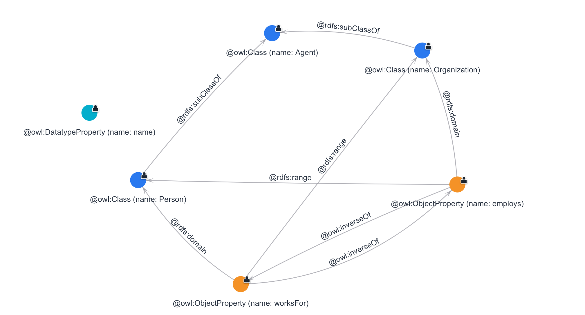

# Inspecting Ontologies

After loading or defining an ontology, you can inspect it two ways:

- **`SHOW` statements** give quick tabular readouts of the ontologies, classes, and properties registered in the graph.
- **`LOAD ONTOLOGY GRAPH`** materializes the ontology as actual nodes and edges you can `MATCH`, traverse, and visualize. 

For a quick look, use `SHOW`; to explore or visualize the ontology's structure, project it.

## Viewing Ontologies

```gql
SHOW ONTOLOGY
```

Example output:

| name | iri | classes | objectProperties | dataProperties |
| -- | -- | -- | -- | -- |
| FOAF | http://xmlns.com/foaf/0.1/ | 14 | 25 | 19 |
| local | urn:local:myOntology | 3 | 1 | 2 |

It lists every ontology in the current graph with summary counts. A single graph can hold multiple ontologies, they come from:

- One per `LOAD ONTOLOGY` import, named after its source IRI.
- One synthetic `local` ontology that groups everything you defined inline with `CREATE CLASS` and `CREATE OBJECT|DATA PROPERTY`.

Related `SHOW` statements for finer views:

```gql
-- Loaded prefix → IRI mappings
SHOW PREFIX

-- Every class, with localName, superClasses, and label
SHOW CLASSES

-- Every object/data property and its full metadata
SHOW PROPERTIES

-- Restrict to one kind
SHOW OBJECT PROPERTIES
SHOW DATA PROPERTIES
```

`SHOW PROPERTIES` returns these columns for each property: `property`, `localName`, `prefix`, `type`, `label`, `comment`, `domain`, `range`, `subPropertyOf`, `equivalentTo`, `inverseOf`, `propertyChain`, `cardinality`, and `characteristics`. `inverseOf` and `propertyChain` apply to object properties only.

## Projecting Ontologies as a Graph

Materialize all ontologies as node and edges:

```gql
LOAD ONTOLOGY GRAPH
```

It projects every class and property currently registered in the graph, whether imported or defined inline, into nodes and edges under the `@owl:` / `@rdfs:` meta-vocabulary (the `owl` and `rdfs` prefixes are auto-registered):

| Element | Becomes |
| -- | -- |
| Each class | a node labeled `@owl:Class` |
| Each object property | a node labeled `@owl:ObjectProperty` |
| Each data property | a node labeled `@owl:DatatypeProperty` |
| `SUBCLASS OF` | an `@rdfs:subClassOf` edge |
| `SUBPROPERTY OF` | an `@rdfs:subPropertyOf` edge |
| `DOMAIN` / `RANGE` | `@rdfs:domain` / `@rdfs:range` edges |
| `INVERSE OF` | an `@owl:inverseOf` edge |
| `EQUIVALENT TO` restrictions | `@owl:someValuesFrom` / `@owl:allValuesFrom` edges (carrying an `onProperty` property) |

Each node carries `_iri`, `name` (the local name), and `prefix`.

> **It projects a structural skeleton, not every axiom.** The table above is the complete set of what the projection materializes. Other features are not drawn as nodes or edges (such as `DISJOINT WITH`, property characteristics, `CARDINALITY`, data-property `DOMAIN` / `RANGE`, etc.). Those are still registered and still do their job, they just don't appear in the projection.

### Example: a local ontology

No file is needed. Inline `CREATE` definitions form the `local` ontology, and `LOAD ONTOLOGY GRAPH` projects them the same way. 

Define a small ontology then project it:

```gql
CREATE GRAPH myOntology WITH ONTOLOGY
USE myOntology
LOAD PREFIX ex FROM 'http://example.org/'

-- Inline ontology (grouped under the synthetic "local" ontology)
CREATE CLASS @ex:Agent
CREATE CLASS @ex:Person SUBCLASS OF @ex:Agent
CREATE CLASS @ex:Organization SUBCLASS OF @ex:Agent
CREATE OBJECT PROPERTY @ex:worksFor DOMAIN @ex:Person RANGE @ex:Organization
CREATE OBJECT PROPERTY @ex:employs DOMAIN @ex:Organization RANGE @ex:Person INVERSE OF @ex:worksFor
CREATE DATA PROPERTY @ex:name DOMAIN @ex:Agent RANGE xsd:string

-- Materialize the ontology as nodes and edges
LOAD ONTOLOGY GRAPH
```

The projected graph looks like this:

<center></center>

Now the ontology is queryable like any other graph:

```gql
-- Classes and their direct superclass
MATCH (sub@owl:Class)-[@rdfs:subClassOf]->(super@owl:Class)
RETURN sub.name, super.name
-- (Person, Agent), (Organization, Agent)

-- Object properties with their domain and range
MATCH (src@owl:Class)<-[@rdfs:domain]-(e@owl:ObjectProperty)-[@rdfs:range]->(dest@owl:Class)
RETURN src.name, e.name, dest.name
-- (Person, worksFor, Organization), (Organization, employs, Person)
```

**The projection is not idempotent.** It has no built-in cleanup, so running `LOAD ONTOLOGY GRAPH` a second time creates duplicate ontology nodes and edges. The projected ontology nodes and edges can coexist with instance data.

To re-project (e.g. after the schema changes), delete the previously projected nodes first, then project again. `DETACH DELETE` removes each node's edges too, so the `@rdfs:` / `@owl:` schema edges go with them; instance nodes (labeled `@:Person`, `@ex:Person`, …) are untouched:

```gql
-- 1. Remove the previously projected schema
-- This assumes the @owl:Class, @owl:ObjectProperty, and @owl:DatatypeProperty labels are used only by the projection
-- If your own data also carries them, scope the delete more narrowly so it doesn't remove that data
MATCH (n@owl:Class) DETACH DELETE n
MATCH (n@owl:ObjectProperty) DETACH DELETE n
MATCH (n@owl:DatatypeProperty) DETACH DELETE n

-- 2. Project the current schema again
LOAD ONTOLOGY GRAPH
```
