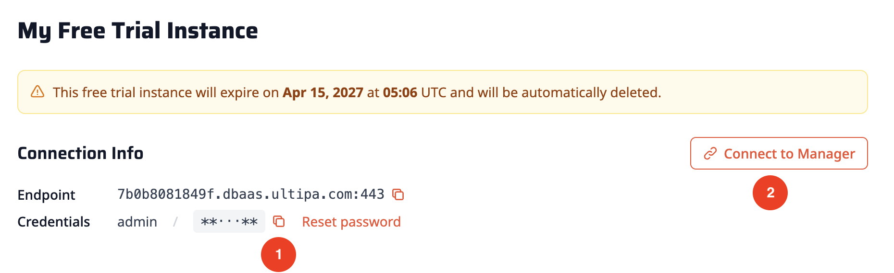
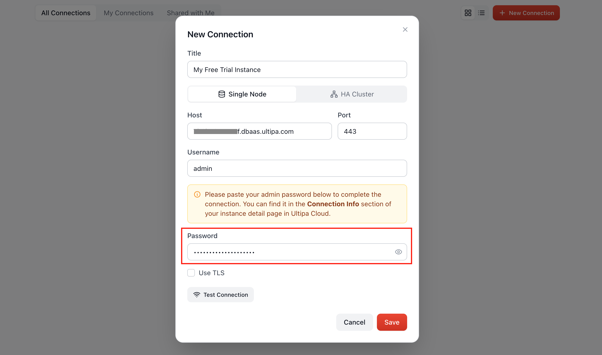
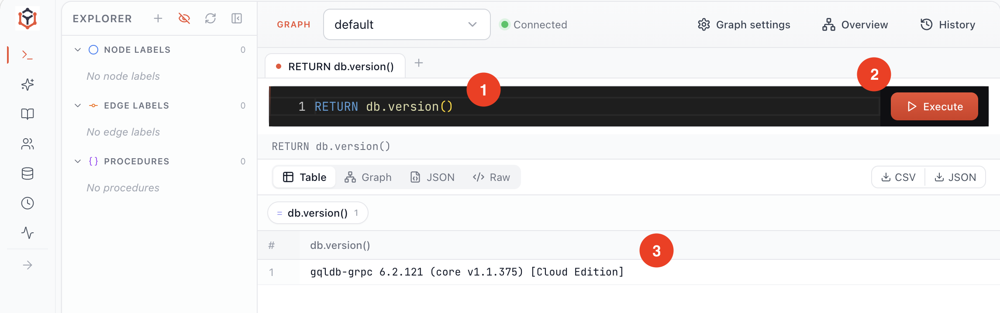

# 1. Install & Connect

There are two paths to spin up a GQLDB instance:

- **[Run locally](#Option-A-Run-Locally)**: A database running on your machine, requires macOS or Linux (Windows via WSL2).
- **[Ultipa Cloud](#Option-B-Ultipa-Cloud)**: A fully-managed database with nothing to install.

However you launched it, you can use **Ultipa Manager** to connect to it, a visual tool for managing your database and running queries.

## Option A: Run Locally

Open your terminal and run:

```bash
# Download the latest GQLDB Community Edition
curl -fsSL https://download.ultipa.com/gqldb/install.sh | sh

# Verify installation
ultipa-gqldb -version
```

On macOS, if the first run fails with a Gatekeeper quarantine error, clear the attribute: `xattr -d com.apple.quarantine "$(command -v ultipa-gqldb)" 2>/dev/null`

Create a database:

```bash
# Create a project directory and enter it
mkdir my-gqldb && cd my-gqldb

# Create a database
ultipa-gqldb -db ./my.gdb -rbac -admin-pass myPassword -port 60061
```

The database instance immediately runs on `localhost:60061`. It runs in the foreground, so its logs stream in this terminal, that is normal and means the server is up. Keep this terminal open (closing it, or pressing Ctrl+C, stops the server). To keep it running in the background instead, launch it with `nohup`.

A few things worth knowing:

- The data directory is created as `my.gdb` in your current folder.
- The admin credential is created as `admin` / `myPassword`.
- No license file is needed. The database is initialized with a `default` graph, and you may create one more graph. Each graph has up to 1M nodes and 1M edges, plenty for most demo projects.

> Connecting a local instance to Ultipa Manager is coming soon. For now, use the <a href="/docs/tools/cli" target="_blank">CLI</a> to run queries against your local database.

## Option B: Ultipa Cloud

Create a fully-managed GQLDB instance on Ultipa Cloud, with nothing to install:

1. In a browser, open <a href="https://dbaas.ultipa.com" target="_blank">Ultipa Cloud</a>, sign in or create an account.
2. From the Dashboard, click **Create instance**. New accounts get a free trial, selected by default, so just confirm to create it.
3. Wait until the instance status shows **RUNNING**.
4. Click **Details** to see the instance endpoint (`xxx.dbaas.ultipa.com:443`) and credentials (`admin` and a password you can copy) under **Connection Info**.

<center></center>

Copy the password and click **Connect to Manager**; Ultipa Manager opens in a new tab. The first time, you will be prompted to add the connection. All fields are auto-filled except the password, paste it and click **Save**:

<center></center>

You will see the connection card added, with a green status indicator next to the connection name. Click the card to enter the connection.

## Run Your First Query

In Manager, you can run the following GQL statement using the query editor to check your database version:

```gql
RETURN db.version()
```

<center></center>

---

You have a running instance and a client that can reach it. Next, put some data in it: <a href="/docs/quick-start/load-data" target="_blank">Load Your Data</a>.