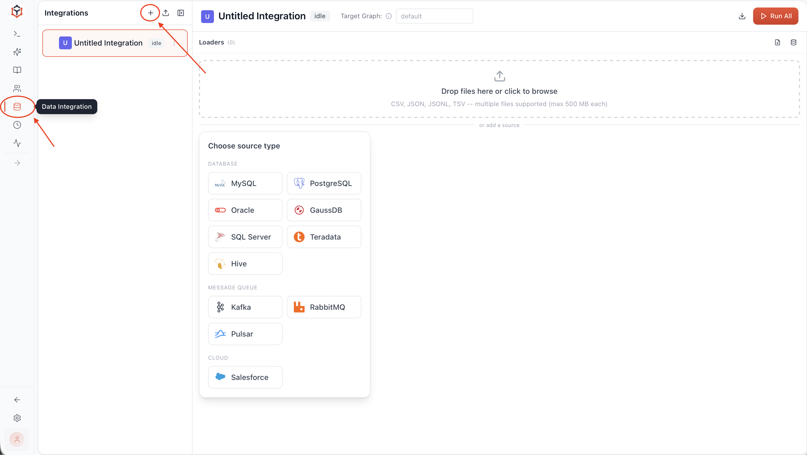

# 2. Load Your Data

In the previous chapter you already ran a simple GQL query through Ultipa Manager. Run the GQL statements in this and all following chapters the same way.

A GQLDB instance can host many graphs (the free, unlicensed edition allows up to 2). The built-in `default` graph is ready to use right away, we will just use it to build this graph:

<center></center>

## The INSERT Statement

For a handful of nodes and edges, write them directly with `INSERT`. The following GQL adds 7 users and the 10 follow relationships between them in a single statement:

```gql
INSERT (alice:User {_id: "u1", name: "Alice", age: 30, city: "London"}),
       (bob:User {_id: "u2", name: "Bob", age: 25, city: "Berlin"}),
       (charlie:User {_id: "u3", name: "Charlie", age: 35, city: "Paris"}),
       (diana:User {_id: "u4", name: "Diana", age: 28, city: "London"}),
       (erik:User {_id: "u5", name: "Erik", age: 42, city: "Berlin"}),
       (fiona:User {_id: "u6", name: "Fiona", age: 31, city: "Paris"}),
       (george:User {_id: "u7", name: "George", age: 26, city: "London"}),
       (alice)-[:Follows {since: 2020}]->(bob),
       (bob)-[:Follows {since: 2021}]->(charlie),
       (charlie)-[:Follows {since: 2022}]->(alice),
       (diana)-[:Follows {since: 2021}]->(alice),
       (erik)-[:Follows {since: 2020}]->(alice),
       (fiona)-[:Follows {since: 2023}]->(alice),
       (bob)-[:Follows {since: 2021}]->(diana),
       (george)-[:Follows {since: 2022}]->(diana),
       (fiona)-[:Follows {since: 2022}]->(charlie),
       (george)-[:Follows {since: 2023}]->(alice)
```

Verify the number of users in the graph:

```gql
MATCH (u:User) RETURN count(u)
```

You should get `7`.

## Bulk Import

For large datasets or data that lives in files (`CSV`, `JSON`) or another system (relational databases, Neo4j, Kafka, BigQuery, RDF), you have the following options:

- **Data Integration** in Ultipa Manager

<center></center>

- **Ultipa Transporter** tool. <a href="/docs/tools/transporter" target="_blank">Learn more</a>

---

Your graph now has data. Time to ask it questions: <a href="/docs/quick-start/query-data" target="_blank">Query Your Data</a>.
